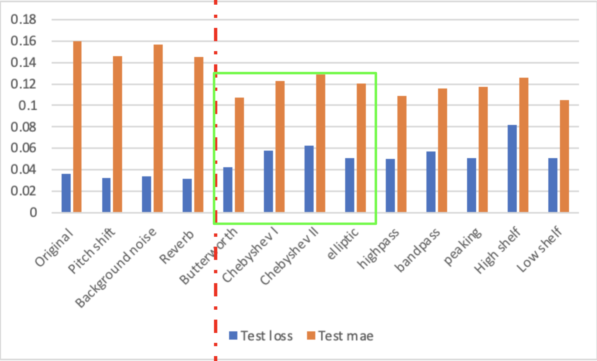

# Filters Implementation in Data Augmentation on Music Emotion Prediction
Created by Duanning WANG for MPATE-GE 2607: Digital Signal Theory II (Spring 2024)
### Project Background
#### motivation
Labeled datasets are always scarce in the field of music, especially those related to emotions. This scarcity is primarily because music is more complex compared to text, and also because emotions are highly subjective. If the participants involved in data collection or the standards for labeling data differ, the results can vary significantly. Therefore, directly merging similar datasets or collecting more data through human effort is often impractical. To address or mitigate the issue of data scarcity, data augmentation is a traditional and effective method. Other music-related works have proved that augmentation methods like pitch shifting, add background noise and reverb can improve the training results. After learning so many different kinds of filters, I am wondering if we can apply filters to augment audio data.
#### introduction of projects
In this project, I will predict the emotion of songs using deep learning method in 2 dimensions - valence and arousal. This kind of prediction of music emotion has many downstream industries, including music recommendation systems, music therapy applications and artist and repertoire (A&R) development.
The models I use are a pre-trained model - YAMNet and a TCN model. Use YAMNet to extract features first and then input those embeddings to TCN model. (detailed model information can be checked in the code)
#### dataset
The dataset I use is PMEmo, which is designed for Music Emotion Recognition (MER) research, includes 794 songs with both static and dynamic emotion labels, electrodermal activity (EDA) signals, song metadata, chorus clips in MP3 format, and pre-computed audio features. This dataset has a manageable size, under 700MB, makes it highly accessible for use on personal computers. As the key point of this project is to explore the effect of using filters to do augmentation, this feature simplifies the process of training and testing models without the need for extensive computational resources.
### Methodology and Design  
First, I use the original data (without any augmentation) and those traditional augmentation methods (pitch shifting, add background noise and reverb) as baselines.
Then do the experiments on filters - lowpass (Butterworth, Chebyshev (type I), Chebyshev (type II) and Elliptic), highpass (Elliptic), bandpass (Elliptic), peaking, low shelf and high shelf.
* __*NOTES*__: 
  1. In order to make the results meaningful, I try to set same value for similar parameters. For example, for all lowpass, highpass and bandpass filters, I set order = 4.
  2. Because of the limitation in time and computation, I only use one filter for highpass and bandpass. So I try to find a filter that is general enough to represent that kind of filters while have some connection to lowpass filter. Butterworth does not have ripple and attenuation, Chebyshev (type I) only has ripple while Chebyshev (type II) only has attenuation. Therefore, I finally chose Ellptic, which has both ripple and attenuation.
  3. The value of retained frequency for peaking filter is decided by the distribution of audio's frequency. I found those audio's frequency mainly concentrated around 200Hz, so I set the retained frequency equal to 200Hz, which will not lose important information of audio.
### Results and Conclusion
##### results of baselines
|                  | Test Loss  (Mean squared error) | Test MAE  (Mean absolute error) |
|------------------|---------------------------------|---------------------------------|
| Original         | 0.036                           | 0.160                           |
| Pitch shift      | 0.032                           | 0.146                           |
| Background noise | 0.034                           | 0.157                           |
| Reverb           | 0.031                           | 0.145                           |
##### results of data augmentated by filters
|              | Test loss           | Test mae            |
|--------------|---------------------|---------------------|
| butterworth  | 0.042 | 0.101 |
| Chebyshev I  | 0.058 | 0.123 |
| Chebyshev II | 0.062 | 0.129 |
| elliptic     | 0.051  | 0.120 |
| highpass     | 0.050 | 0.109  |
| bandpass     | 0.056 | 0.116 |
| peaking      | 0.050 | 0.117 |
| high shelf   | 0.082 | 0.126  |
| low shelf    | 0.051 | 0.105 |

In order to make it easier to analyze the results, I plot them. The four pairs of bars on the left of the red dotted line are the results for baselines, while those on the right are results augmented by filters. The bars in green box are augmented by lowpass filters.

One interesting phenomenon I found is that the results after being augmented by filters can get higher MSE while lower MAE. According to the definition of MSE and MAE, MSE is more sensitive to outliers as it square the difference between prediciton and the real one. In this senario, I think we do not need to penalize large errors. So we can evaluate mainly using MAE. Here are the conclusions:
1. Using filters to do the augmentation leads to some notable outliers, but the overall performances are better.
2. All of filters contributes to the improvement. Butterworth lowpass filter performs the best.
3. The results of applying low-pass filters have no commonality. The results depend on the specific situations.
### Future Thoughts
In the future, I think we can try to design the filters based on audio’s characteristics dynamically. Since the dataset provide the labels which are not only static, but also dynamically for every two seconds. And as different audio has different distribution of frequency, the choice of filters and the parameters of filters can also varied based on that.
In addition, we can try to use the combination of filters, like combine butterworth lowpass filter with elliptic highpass filter, or apply butterworth filter after shifting the pitch.
### Reference
Zhang, K., Zhang, H., Li, S., Yang, C., & Sun, L. (2018, June). The PMEmo dataset for music emotion recognition. In Proceedings of the 2018 acm on international
conference on multimedia retrieval (pp. 135-142).
